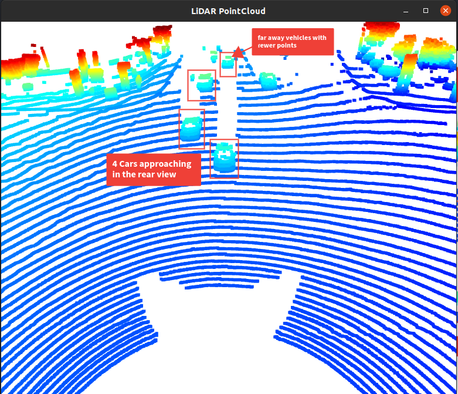
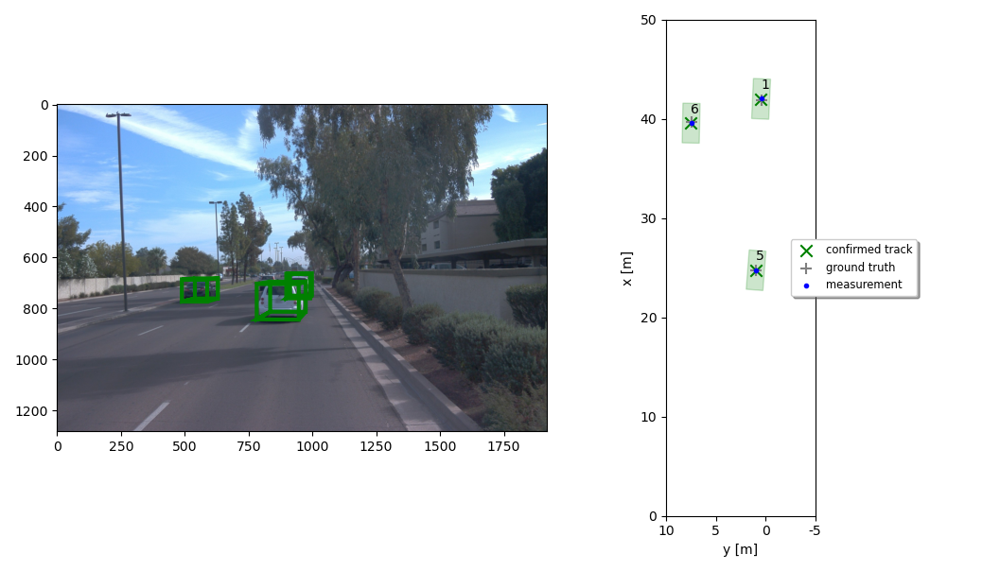
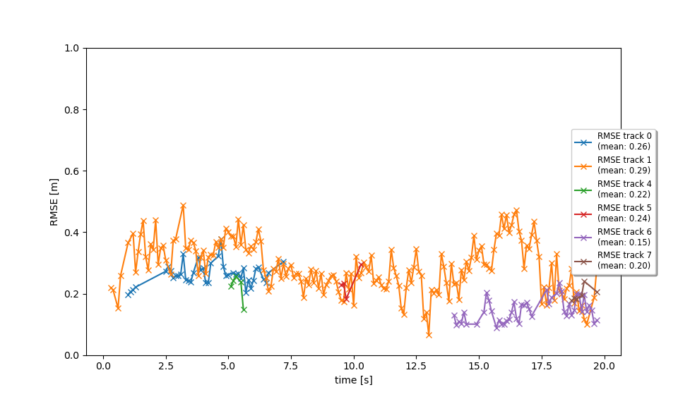

# SDCND : Sensor Fusion and Tracking

# MidTerm Project
## Compute Lidar Point-Cloud from Range Image
### Visualizing range image channels

### Visualizing point-cloud

|             Front            |             Rear            |
|:----------------------------:|:---------------------------:|
|  |  |

## Birds-Eye View from Lidar PCL

### Converting sensor coordinates to bev-map coordinates

### intensity & height layer of bev-map
|             Intensity Map              |            Height Map            |
|:--------------------------------------:|:--------------------------------:|
|  |  |

## Model-based Object Detection in BEV Image

## Performance Evaluation for Object Detection

# Writeup: Track 3D-Objects Over Time (Final Project)

## Step 1: Implementing an Extended Kalman Filter
EKF has 3 main steps prediction, measurement and update.
- First was adding the representation of the state of the system which consist of process model and velocity.
- working on the prediction function the following matrices were needed (System matrix **F**, process noise covariance **Q**) both these matrices where implemented using the saved parameters in params.py.
- for the update function measurment matrix (H), Gamma residual , covariance of the residual (S), kalman gain(K), state update and covariance update all were calculated to update the state x and covariance P.

## Step 2: Implementing the track management to initialize and delete tracks, set a track state and a track score.
- initializing new track from inassigned measurements
- Transform the unassigned measurement from sensor to vehicle coordinates
- manage track score based on the threshold to keep or delete the track
- handle updated track to change the state wether it's comfirmed or tentative using the confimed threshold
## Step 3: Implementing a single nearest neighbor data association to associate measurements to tracks.
- Data association for the track and measurement using Mahalanobid distance 
## Step 4: Implementing the nonlinear camera measurement model.
- Use non-linear function to transform KF state into camera and image space.

## Benefits in camera-lidar fusion vs lidar-only tracking
- **Accuracy**: Cameras and lidar sensors have different strengths and weaknesses. Cameras are better at detecting objects and edges, while lidar sensors are better at measuring depth. By fusing the data from both sensors, it is possible to create a more accurate 3D model of the environment.
- **Reliability**: Cameras and lidar sensors are both susceptible to noise and errors. By fusing the data from both sensors, it is possible to reduce the impact of these errors.
- **Robustness**: Cameras and lidar sensors can be affected by different environmental conditions. For example, cameras can be blinded by bright sunlight, while lidar sensors can be affected by rain or snow. By fusing the data from both sensors, it is possible to create a more robust system that can operate in a variety of conditions.

### Challenges in real-life scenarios:
- **Data fusion**: Sensor fusion systems must be able to fuse data from multiple sensors in real time. This can be a challenging task, as the data from different sensors may be in different formats, have different resolutions, and be subject to different levels of noise.
- **Environmental conditions**: Sensor fusion systems must be able to operate in a variety of environmental conditions, including rain, snow, fog, and bright sunlight. These conditions can make it difficult for sensors to collect accurate data.
- **Motion**: Sensor fusion systems must be able to operate in a variety of motion conditions, including acceleration, deceleration, and turning. These conditions can cause the sensors to produce inaccurate data.
- **Malfunction**: Sensor fusion systems must be able to handle sensor malfunctions. If a sensor fails, the sensor fusion system must be able to continue operating without the failed sensor.

## Challenges 
- one of the simple yet significant challenge was continuing the project on the midterm loop_over_dataset.py file as I have encountered diffrent and not satisfying results like the RMSE for more than 3 tracks and the tracking method did not work good for all the cars appearing.

**Before downloading and using the loop_over_dataset.py from the final project workspace**

**After**

